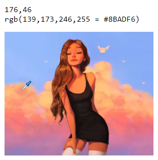

# HTML5 Image Color Picker

This is a simple serverless web page to paste images and read the color of their pixels.

[Click here to access the page](https://grossato.com.br/html5-image-color-picker/)

It's useful for designers and people who just need to know what color a pixel is and don't have anything installed that supports this, such as linux, or systems where this is cumbersone to read it (windows).

## Demo

